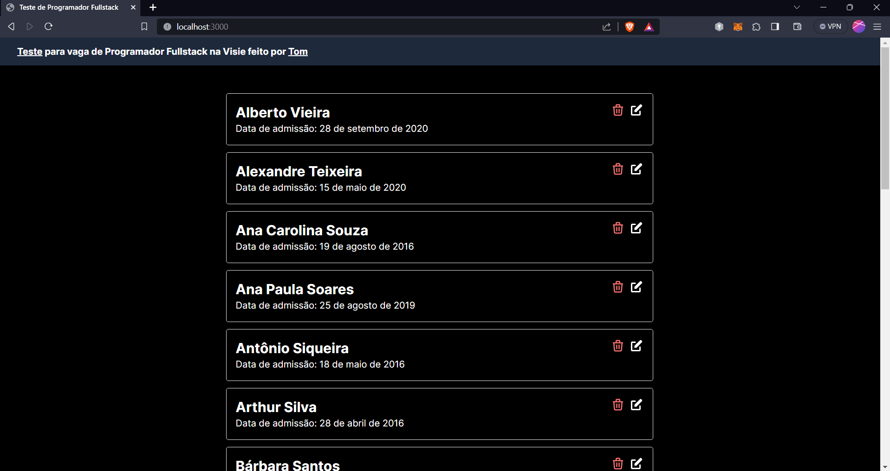
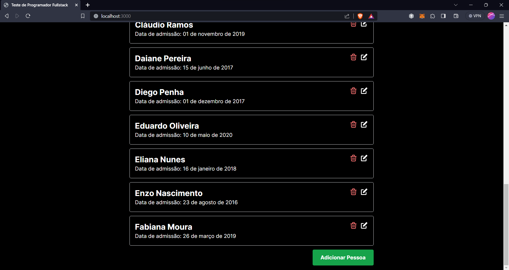
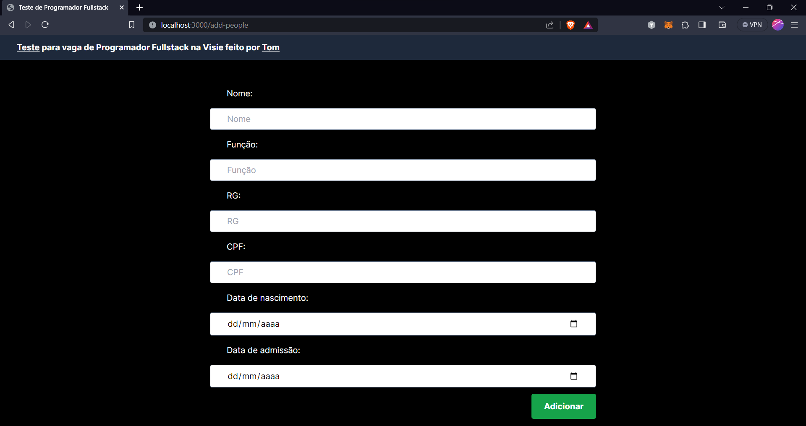
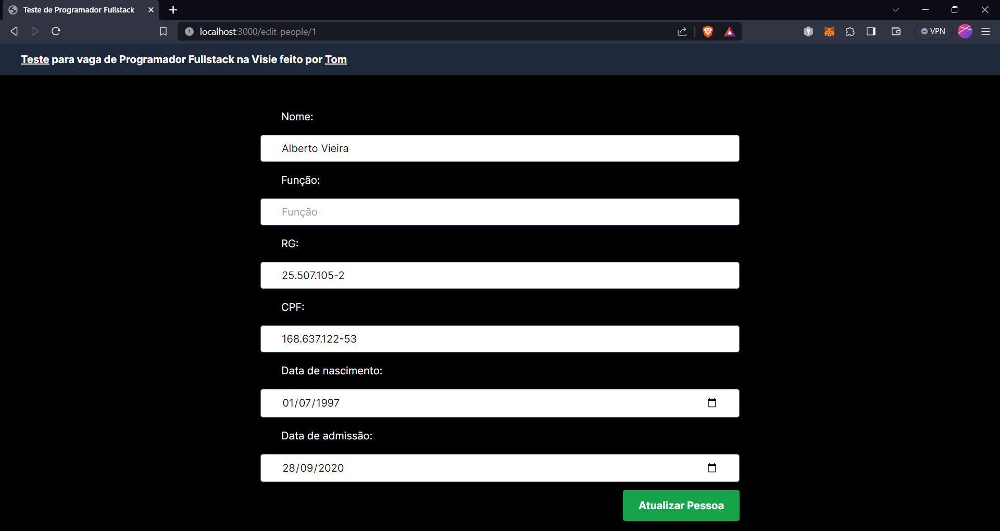
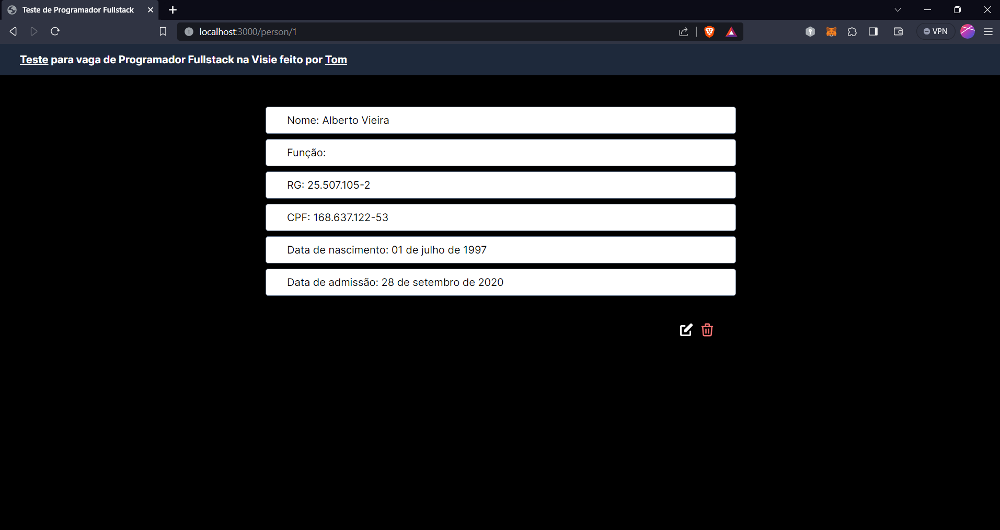
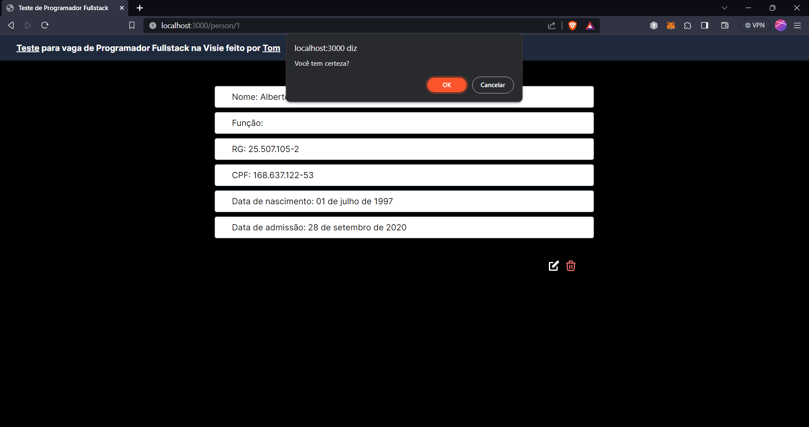
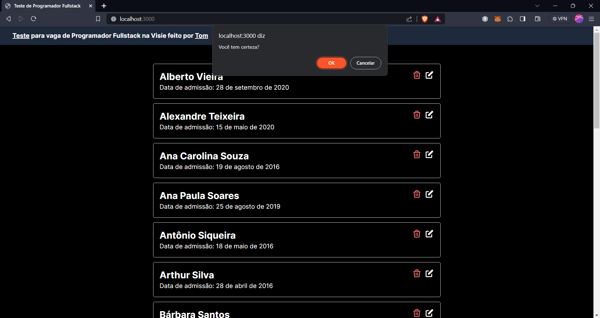

# Visie-test

<p align="center">
   
</p>

<p align="center">
   <a href="https://www.linkedin.com/in/wellington-barros-593ba0137/">
      
   </a>
  
</p>

Project made to test the developer's fullstack job at Visie

<p align="center">
    <a href="README.md">English</a>
    ·
    <a href="README-pt.md">Portuguese</a>
 </p>

<div align="center">
  <sub>Crud People to Visie. Built with ❤︎ by
    <a href="https://github.com/wfTom">wfTom</a>
  </sub>
</div>

<p align="center">
   <a href="#bookmark-about">About</a>&nbsp;&nbsp;&nbsp;|&nbsp;&nbsp;&nbsp;
   <a href="#construction_worker-how-to-run">How to run</a>&nbsp;&nbsp;&nbsp;|&nbsp;&nbsp;&nbsp;
   <a href="#memo-licença">License</a>
</p>
  
## :bookmark: About

The **CRUD People Visie** is a Web and Server application of a CRUD of people, in this application is possibible created a new people, updated and deleted.

<div>
   
   
</div>
<div>
   
   
</div>
<div>
   
   
</div>
<div>
   
</div>

- ### **Requirements**

  - It is **necessary** to have **[Node.js](https://nodejs.org/en/)** installed
    on the computer.
  - It is **optional** to have **[Git](https://git-scm.com/)** installed and
    configured on the computer, but it is better to have.
  - Also, it is **necessary** to have a package manager be the
    **[NPM](https://www.npmjs.com/)** or **[Yarn](https://yarnpkg.com/)**.

```bash
# Clone Repository
$ git clone https://github.com/wfTom/test_frontend-visie
```

### 📦 Run API

Access API repository at https://github.com/wfTom/test_backend-Visie

### 💻 Run Web Project

```bash
# Go to web folder
$ cd test_frontend-visie

# Install Dependencies
$ npm install

# Run Application
$ npm dev
```

Go to http://localhost:3000/ to see the result.

# :closed_book: License

Released in 2023 :closed_book: License

Made with love by [wfTom](https://github.com/wfTom) 🚀. This project is under
the [MIT license](./LICENSE).

Give a ⭐️ if this project helped you!
